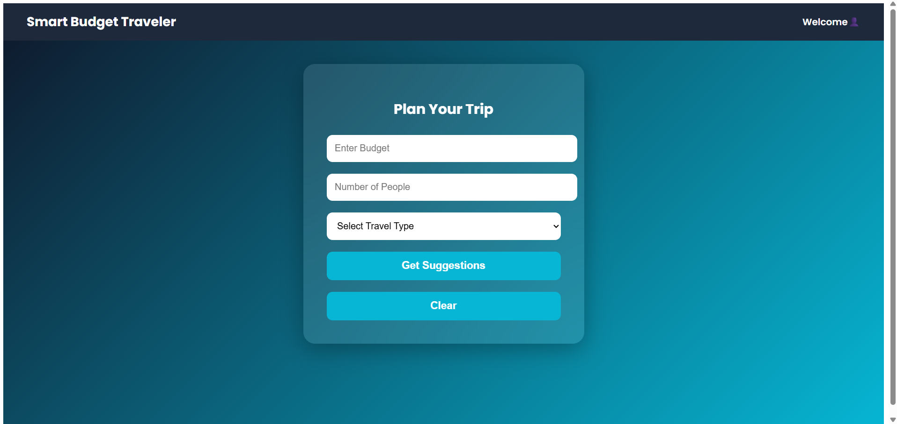

✈️ Smart Travel Budget App

A full-stack travel planning web application that provides personalized destination suggestions based on user budget and number of travelers. Users can explore destinations, view nearby hotels, and book stays seamlessly.

🚀 Features

🔐 User Authentication

Secure Registration & Login system

Session-based authentication

💰 Budget-Based Destination Suggestions

Users enter:
Total Budget
Number of Travelers

System recommends suitable destinations within budget

🏝️ Dynamic Destination Pages

Displays destination details

Lists nearby hotels

🏨 Hotel Listing & Booking

Hotel Name

Price per Night

Booking functionality

🔄 REST API Integration

Backend APIs built using Django

Frontend consumes APIs using React

📱 Responsive UI

Built with Bootstrap for mobile-friendly experience

🛠️ Tech Stack
Frontend

React.js
TypeScript
Bootstrap
Axios (for API calls)

Backend

Django
Django REST Framework
PostgreSQL

Tools

Git
VS Code

📂 Project Architecture
Smart-Travel-Budget-App/
│
├── frontend/ (React)
│   ├── Login Page
│   ├── Register Page
│   ├── Home Page (Budget Input)
│   ├── Destination Details Page
│   └── Hotel Booking Page
│
├── backend/ (Django)
│   ├── Models (User, Destination, Hotel, Booking)
│   ├── Views
│   ├── REST APIs
│   └── Authentication System
⚙️ How It Works

User registers and logs in.

After login, user enters:

Budget

Number of people traveling

System suggests destinations within budget.

User selects a destination.

Nearby hotels are displayed with:

Hotel Name

Price per Night

User books hotel.

📸 Screenshots

(Add screenshots here)

.

🔧 Setup Instructions
Backend Setup
cd backend
pip install -r requirements.txt
python manage.py migrate
python manage.py runserver
Frontend Setup

cd frontend
npm install
npm start

👩‍💻 Author

Rishitha Kandimalla
GitHub: https://github.com/Rishitha-2106

